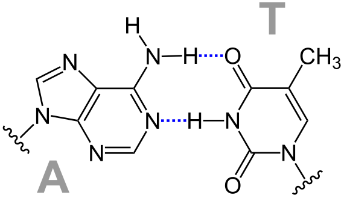
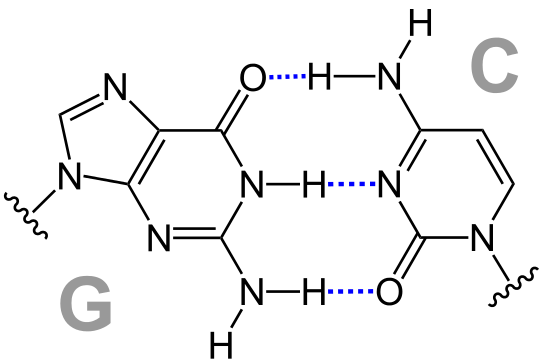

# Exercice 4

L'acide désoxyribonucléique ou ADN est une macromolécule biologique présente dans toutes les cellules ainsi que chez de nombreux virus. L'ADN contient toute l'information génétique permettant le développement, le fonctionnement et la reproduction des êtres vivants. 

|||
|------------------------|------------------------|

Les quatre bases constitutives de l'ADN sont l'adénine (A), la cytosine (C), la guanine (G) et la thymine (T). La représentation de brins d'ADN se fait donc à l'aide des 4 caractères `A`, `C`, `G` et `T`.

Identifier et compter des séquences ADN est capital dans la recherche de certaines maladies.

## A réaliser

Écrire un programme qui permet d'encoder deux chaînes de caractères représentant des brins d’ADN et qui va cafficher le nombre de fois que le premier brin d'ADN se retrouve dans le second.

Soyez attentifs à la découpe du programme en fonctions !

**! Les fonctions qui manipulent des chaînes de caractères doivent le faire en utilisant les pointeurs explicitement (i.e. sans utiliser de [])**

## Exemple

```
Sequence d'ADN a chercher = ACTG
dans la sequence d'ADN = AACCTTACTACTGGGTCAAACADAGGGTACTGGTG

La sequence ACTG se retrouve 2 fois dans la sequence AACCTTACTACTGGGTCAAACADAGGGTACTGGTG
```
